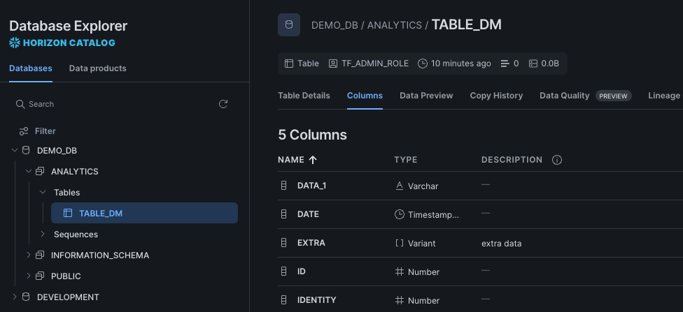
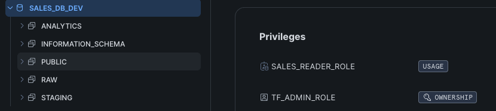
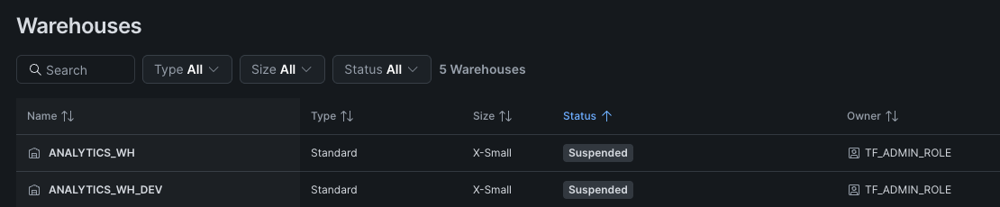

# Snowflake Infrastructure as Code with Terraform

A production-oriented example of managing **Snowflake infrastructure using Terraform**, with reusable modules, role-based access control (RBAC), remote state management, lifecycle protection, and automated CI/CD through GitHub Actions.

This project demonstrates how Snowflake infrastructure can be **version-controlled, reproducible, and automatically deployed** using Infrastructure as Code (IaC).

> 💡 **Usage Note:** This structural blueprint provides a solid foundational framework for tracking state and setting up resource guardrails. However, **all deployment risk rests solely on the user**. You must thoroughly test these configurations in a non-production environment. The author accepts no responsibility for unintended modifications, resource updates, or data loss.

## Architecture
```text
Developer
    │
    │  Git Push / Pull Request
    ▼
GitHub
    │
    ▼
GitHub Actions
    │
    ├── terraform fmt
    ├── terraform validate
    ├── terraform plan
    └── terraform apply
    │
    ▼
HCP Terraform
Remote State
    │
    ▼
Snowflake
    ├── Databases
    ├── Schemas
    ├── Warehouses
    ├── Roles
    ├── Grants
    ├── Sequences
    └── Tables
```

## Key Features

* Infrastructure as Code for Snowflake resources
* Reusable Terraform modules
* Snowflake RBAC and grant management
* Environment-dependent infrastructure configuration
* HCP Terraform remote state
* Automated deployment with GitHub Actions
* CI validation with terraform fmt, validate, and plan
* Production table protection using prevent_destroy
* Separation of infrastructure provisioning from data transformation responsibilities

### Setup and configuration Examples
### 1. Bootstrap Snowflake Permissions

Run the following script as an `ACCOUNTADMIN` in your Snowflake console to establish a secure, dedicated service role for the Terraform runner.

```sql
-- 1. Switch to ACCOUNTADMIN for bootstrapping
USE ROLE ACCOUNTADMIN;

-- 2. Create the dedicated Terraform Service Role
CREATE ROLE IF NOT EXISTS TF_ADMIN_ROLE;

-- 3. Grant system admin capabilities to the custom role
GRANT ROLE SYSADMIN TO ROLE TF_ADMIN_ROLE;
GRANT ROLE SECURITYADMIN TO ROLE TF_ADMIN_ROLE;

-- 4. Grant global privileges required for structural state tracking
GRANT MANAGE GRANTS ON ACCOUNT TO ROLE TF_ADMIN_ROLE;
GRANT ROLE TF_ADMIN_ROLE TO USER DEMO_USER;

-- 5. Force deployment context defaults
ALTER USER DEMO_USER SET DEFAULT_ROLE = TF_ADMIN_ROLE;

-- 6. Register the public key for key-pair (JWT) authentication
-- (see "Generate an RSA Key Pair" below for how to create rsa_key.pub)
ALTER USER DEMO_USER SET RSA_PUBLIC_KEY='<paste contents of rsa_key.pub here, without header/footer lines>';
```

### 1a. Generate an RSA Key Pair for Terraform Authentication

Terraform authenticates to Snowflake using key-pair (JWT) auth rather than a
password. Generate a key pair locally and keep the private key out of source
control (already covered by `.gitignore`):

```bash
# Generate an unencrypted PKCS8 private key
openssl genrsa 2048 | openssl pkcs8 -topk8 -inform PEM -out rsa_key.p8 -nocrypt

# Derive the matching public key
openssl rsa -in rsa_key.p8 -pubout -out rsa_key.pub
```

Register the contents of `rsa_key.pub` on the Snowflake user (step 6 above),
then set the contents of `rsa_key.p8` as the `snowflake_private_key` **Terraform
variable** (not an Environment Variable — HCP Terraform's Environment Variable
category rejects values containing newlines, and a PEM key is always
multi-line) in the workspace, marked sensitive — never commit the `.p8` file
itself.

---

### 2. Infrastructure Code Blueprint (`providers.tf`)

This baseline configuration targets the modern `v2.19.0` provider engine, safely handles stable `snowflake_table` resource previews, and binds executions to HCP Terraform Cloud.

```hcl
terraform {
  required_providers {
    snowflake = {
      source  = "snowflakedb/snowflake"
      version = "~> 2.19.0"
    }
  }

  backend "remote" {
    organization = "air_space"

    workspaces {
      name = "gh-actions-demo"
    }
  }
}

provider "snowflake" {
  # Key-pair (RSA JWT) authentication instead of username/password.
  # private_key is a Terraform variable (not an env var) because it's a
  # multi-line PEM value - see "Generate an RSA Key Pair" above.
  authenticator = "SNOWFLAKE_JWT"
  private_key   = var.snowflake_private_key

  # Required toggles to authorize modern stable table and sequence components
  preview_features_enabled = [
    "snowflake_sequence_resource",
    "snowflake_table_resource"
  ]
}
```

---

### 3. Data Loss Prevention: Table Destruction Guardrails

To prevent data loss from accidental resource recreation (e.g., changing an immutable column property), **always** include a `lifecycle` block with `prevent_destroy = true` on production tables.

```hcl
resource "snowflake_table" "analytics_reporting" {
  database = "ANALYTICS"
  schema   = "PUBLIC"
  name     = "REPORTING_METRICS"

  column {
    name = "id"
    type = "NUMBER(38,0)"
  }

  column {
    name = "created_at"
    type = "TIMESTAMP_NTZ(9)"
  }

  # Enforces a hard error inside CI/CD if an operation attempts to drop this table
  lifecycle {
    prevent_destroy = true
  }
}
```

---

### 4. Configuration & Variable Mapping

Ensure your environment mappings align with the state rules below.


| Value | Category | Actions |
| :--- | :--- | :--- |
| environment | dev | terraform |
| SNOWFLAKE_ACCOUNT_NAME | your-account-name | env |
| SNOWFLAKE_ORGANIZATION_NAME | your-org-name | env |
| SNOWFLAKE_USER | DEMO_USER | env |
| snowflake_private_key <br> *(Sensitive)* | PEM-encoded RSA private key - write only | terraform |
| SNOWFLAKE_PRIVATE_KEY_PASSPHRASE <br> *(Sensitive, optional)* | Passphrase for the private key, if encrypted | env |


---

### 5. Automated CI/CD Pipeline (`.github/workflows/terraform.yml`)

Create a file at `.github/workflows/terraform.yml` to automate your deployments. This workflow leverages your encrypted repository secret `TF_API_TOKEN` to securely execute inside Terraform Cloud.

```yaml
name: "Terraform Cloud Deployment"

on:
  push:
    branches:
      - main
  pull_request:
    branches:
      - main

permissions:
  contents: read
  pull-requests: write

jobs:
  terraform:
    name: "Terraform Run"
    runs-on: ubuntu-latest
    steps:
      - name: Checkout Code
        uses: actions/checkout@v4

      - name: Setup Terraform CLI
        uses: hashicorp/setup-terraform@v3
        with:
          cli_config_credentials_token: \${{ secrets.TF_API_TOKEN }}

      - name: Check Code Format
        run: terraform fmt -check -diff

      - name: Initialize Workspace
        run: terraform init -upgrade

      - name: Validate Configurations
        run: terraform validate

      - name: Generate Execution Plan
        id: plan
        run: terraform plan -no-color
        continue-on-error: true

      - name: Apply Approved Changes
        if: github.ref == 'refs/heads/main' && github.event_name == 'push'
        run: terraform apply -auto-approve
```

---

### 6. Snowflake examples which managed by terraform:


**Database, schema, sequences and table are created by resource directly example**



**Database, schemas created based on modules**



**Warehouse created by resource and modules**



### Automated CI/CD Lifecycle Flow
1. **Develop**: Modify or extend Snowflake definitions inside your local `.tf` files.
2. **Review**: Check changes into a Git feature branch and open a GitHub Pull Request (PR).
3. **Trigger**: Merging code into the `main` branch automatically initiates the GitHub Actions runner.
4. **Validate**: The pipeline evaluates canonical format checks (`terraform fmt -check`), code validation, and target plans.
5. **Sync**: The authorized engine executes steps, updating or creating Snowflake objects synchronously.

## Terraform and dbt thoughts

Terraform and dbt solve different parts of the Snowflake data platform lifecycle.

**Terraform — Infrastructure**
```text
Terraform
   ↓
Snowflake account setup
   ├── Databases
   ├── Schemas
   ├── Warehouses
   ├── Roles
   ├── Users / service accounts
   ├── Grants
   ├── Resource monitors
   └── Integrations
```
Terraform is responsible for provisioning and controlling infrastructure.

**dbt — Data Transformation**
```text
Raw Data
    │
    ▼
Snowflake RAW Layer
    │
    ▼
dbt
    ├── Staging Models
    ├── Intermediate Models
    ├── Fact Tables
    ├── Dimension Tables
    ├── Tests
    └── Documentation
    │
    ▼
Analytics / BI
```
dbt is responsible for transforming and modeling data already stored in Snowflake.

Together, they provide a clean separation of responsibilities. 

For reference: [dbt Projects on Snowflake](https://github.com/pxwang/getting-started-with-dbt-on-snowflake)
