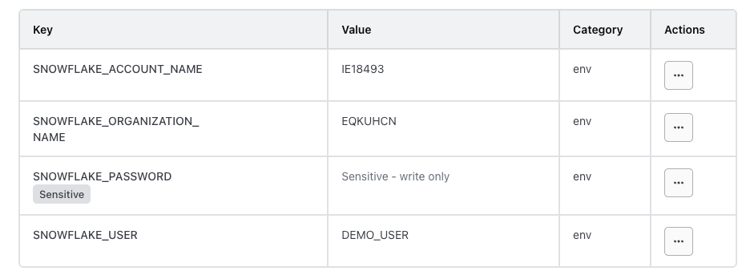

## Setup Demo account with roles  permisson

```sql
-- 1. Switch to ACCOUNTADMIN for bootstrapping
USE ROLE ACCOUNTADMIN;

-- 2. Create the dedicated Terraform Role
CREATE ROLE IF NOT EXISTS TF_ADMIN_ROLE;

-- 3. Grant system admin capabilities to the custom role
GRANT ROLE SYSADMIN TO ROLE TF_ADMIN_ROLE;
GRANT ROLE SECURITYADMIN TO ROLE TF_ADMIN_ROLE;

-- 4. Grant required global privileges for complete state tracking
GRANT MANAGE GRANTS ON ACCOUNT TO ROLE TF_ADMIN_ROLE;
GRANT ROLE TF_ADMIN_ROLE TO USER DEMO_USER;
ALTER USER DEMO_USER SET DEFAULT_ROLE = TF_ADMIN_ROLE;
```

## Terraform Variables Configuration



## Database, Schema, Table created from Terraform  


## CI/CD flow
1. Change code in terraform (main.tf)
2. Check in GitHub into branch and merge into main (PR)
3. Github action workflow is triggered which setup Terraform. 
4. Terraform format check, validation, apply.
5. Snowflake resource created/updated accordingly.